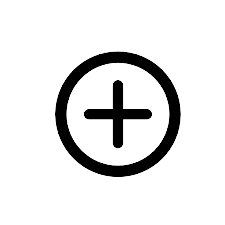
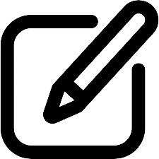

# Better Membean by Carlos Quiñones

This extension applies a theme to your membean sessions. 

# Example

 

# Basic Information:

1.Only use the extension once you are in a membean session or on the screen that lets you chose the length of your session.To use the extension click on the icon on your top rigth   
 
2.The Plus button alows you to create your own theme that will then be saved for later use.You have a maximum of 9 theme slots availabe.   
 
3.To set a background image you must first have the url for the image, which can be found by left clicking the source of the image and and clicking copy image adress.   

3.The Edit Theme button is found beside the Plus button and once clicked you will be put into edit mode, in which you can then click on the theme you want to edit. 
 
4.Download the zip file to use!!

# How to Load a Chomre Extension:

1.Go to chrome://extensions/  
2.On the top left click Load Unpacked   
3.And choose the unziped folder of the extension

